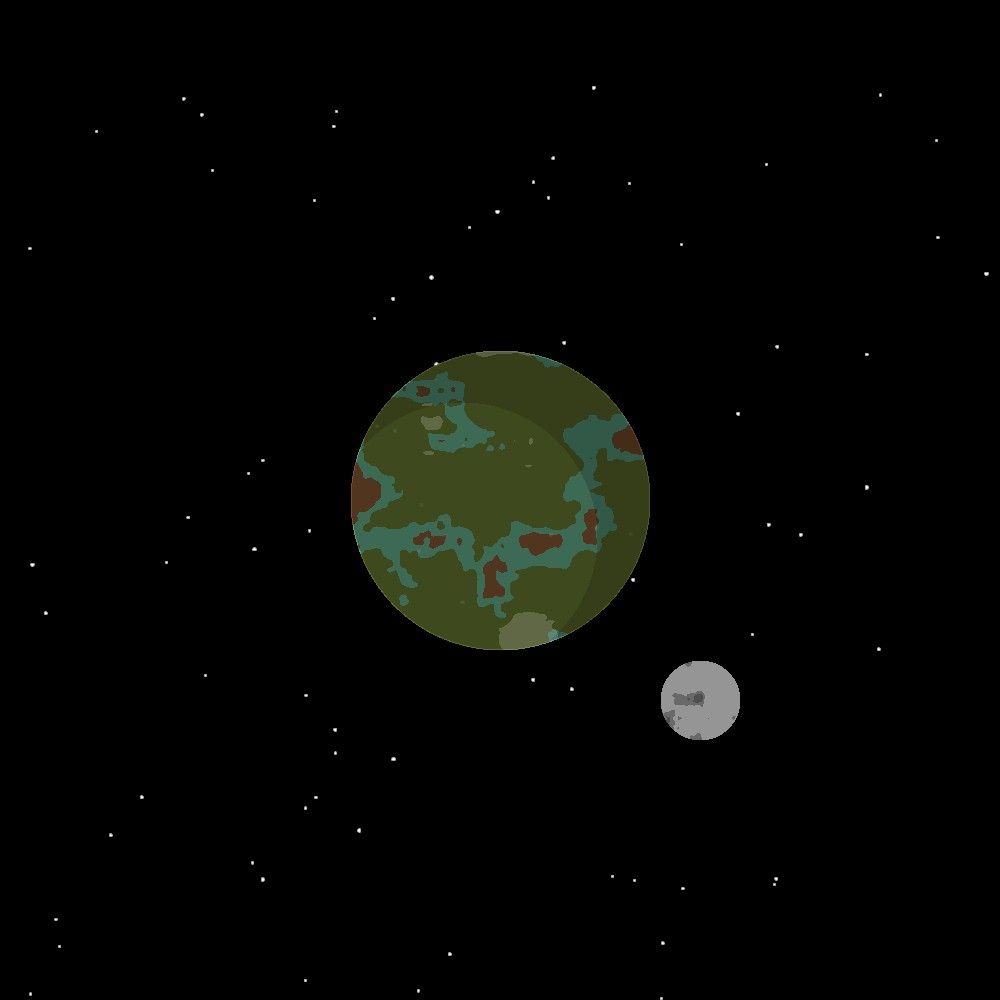

# Random Planet Generator
This is a random planet generator created in Processing using Java. It allows you to create 2d space textures with a planet and moons in it.

## Create Planet
Call this functions to create a random 2D planet
- radius: integer to change the planet radius
```bash
$ drawPlanet(int radius)
```
## Add Moon
Call this functions to add a moon to the texture
- radius:  integer to change the moon radius
- distance:  integer to change the moon distance from the planet
```bash
$ drawMoon(int radius, int distance)
```
